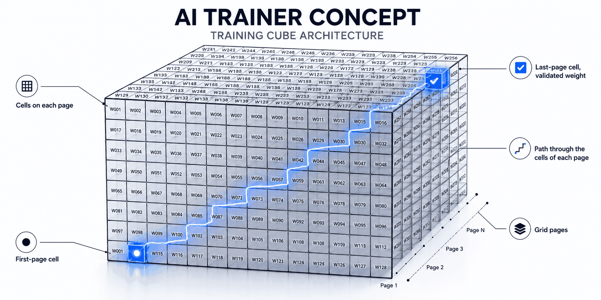

<p align="center">
  
</p>

# Bricks AI

**Bricks AI** is an experimental AI training and runtime project written in Rust. It explores a non-traditional model-building approach based on structured grids, stacked pages, numbered cells, engraved weights, parallel dimensions, convergence paths, and reusable local knowledge packs.
Instead of treating training as a black-box sequence of weight updates, Bricks AI represents the model as a navigable training cube. Each grid page contains cells, each cell can carry a weight, and training paths move through these cells across multiple pages. Candidate paths compete across parallel dimensions, are cross-validated, reinforced when they agree, and destroyed when they fail pre-final validation. 
The goal is to progressively converge many possible paths toward a smaller set of validated, engraved weights.
The project includes a local trainer, checkpointing, benchmark reporting, structured knowledge-pack generation, convergence logic, pre-final candidate destruction, and an experimental runtime format for interpreting exported engraved models.
Bricks AI is not a production machine learning framework. It is research-oriented software intended to explore alternative ways of building, validating, pruning, and interpreting AI-like structures with a strong focus on transparency, local execution, reproducibility, and architectural experimentation.

## License

This project is licensed under the Apache License 2.0.

Experimental raw AI trainer based on grids, pages, cells, weights, correlations, gradients, pruning and engraved weights.

## V22: local GPU/CPU + provider APIs preserved

This build removes all remote notebook/remote GPU delegation. Training runs locally.

It keeps the provider system:

- Ollama local
- OpenAI API
- Anthropic API
- Gemini API
- Mistral API
- xAI API
- DeepSeek API
- Groq API
- Together API

Provider routing is controlled with:

```env
BRICKS_AI_PROVIDER_MODE=ollama-only
BRICKS_AI_PROVIDER_MODE=local-first
BRICKS_AI_PROVIDER_MODE=cloud-only
BRICKS_AI_PROVIDER_MODE=round-robin
```

## Local device behavior

Bricks AI detects a local GPU using `nvidia-smi` first, then Windows `wmic`.

```env
BRICKS_AI_DEVICE=auto
```

Valid values:

```env
BRICKS_AI_DEVICE=auto
BRICKS_AI_DEVICE=gpu
BRICKS_AI_DEVICE=cpu
```

If no compatible local GPU is detected, Bricks AI falls back to CPU automatically. Ollama may still use local GPU acceleration if Ollama itself supports the machine.

## Commands

```bash
cargo run -- device
cargo run -- providers
cargo run -- ollama-test
cargo run -- train-pack --steps 500 --items 8 --depth 2
cargo run -- train-pack --resume --steps 500
cargo run -- inspect-model --model engraved_model.json
cargo run -- predict --model engraved_model.json --input "hello bricks"
```

## Local training

The trainer uses generated and validated data from the active provider pool. In `local-first`, Ollama is tried first, and API providers can be used as fallback when their keys are present.

Outputs:

- `bricks_ai_checkpoint.bin` for resume
- `engraved_model.json` for runtime/interpreter use
- `runtime_model.json` when exported with `export-runtime-model`

## Safety

Do not commit `.env` with real API keys.

## Benchmark reports

Every `train-pack` run now writes benchmark data at the end of training:

```bash
cargo run -- train-pack --steps 500 --items 8 --depth 2
```

Outputs:

```text
benchmark_report.json  # detailed captures: events, training state, confidence, CPU/RAM/GPU snapshot
benchmark_report.csv   # one-line summary for Excel/Sheets
```

Tracked metrics include elapsed time, internal ticks, trained/accepted/rejected items, queue remaining, engraved cases/correlations, average/max case confidence, average/max correlation score, final probe prediction, model/checkpoint size, CPU logical cores, RAM, GPU name and NVIDIA GPU memory/utilization when `nvidia-smi` is available.

Configure paths with:

```env
BRICKS_AI_BENCHMARK_JSON=benchmark_report.json
BRICKS_AI_BENCHMARK_CSV=benchmark_report.csv
```

## V24 - Parallel Dimensions Engine

V24 adds a local-only parallel dimensions trainer. Instead of increasing the number of cases per grid, Bricks AI now races several deterministic grid/page/case realities for the same validated item. The best validated path wins, while agreeing dimensions can cross-validate and reinforce alternative paths.

New `.env` controls:

```env
BRICKS_AI_PARALLEL_DIMENSIONS_ENABLED=true
BRICKS_AI_PARALLEL_DIMENSIONS=8
BRICKS_AI_DIMENSION_SELECTION=best_validated
BRICKS_AI_DIMENSION_CROSS_VALIDATE=true
BRICKS_AI_DIMENSION_MIN_AGREEMENT=2
BRICKS_AI_DIMENSION_MAX_CROSS_VALIDATIONS=2
BRICKS_AI_DIMENSION_LOSS_AGREEMENT_MARGIN=0.08
BRICKS_AI_DIMENSION_DIVERSITY_BONUS=0.10
```

The benchmark report now includes wall time, active training time, pause time, average time per trained item, average time per internal tick, provider generation/validation time, model-training time, checkpoint time, dimension winner counts, agreement rate, unique winner paths, cross-validated paths, active correlations, and preferred paths.

Progress bars now use `indicatif` and display elapsed time, ETA, trained items, queue size, accepted/rejected items, active paths, dimensions, winner paths, and pause time.

## V26 - Knowledge Packs

V26 adds local reusable knowledge packs. Training now works in hybrid mode by default:

1. Bricks checks `knowledge_packs/<domain>.json` first.
2. If validated items already exist for the theme, Bricks trains from the local pack immediately.
3. If the pack is missing items, Bricks asks Ollama/API to generate the missing data.
4. Generated + validated items are saved back into the pack for future runs.

This turns domains like `Mathematics` from pure continuous extraction into a reusable local teacher-built pack plus continuous enrichment.

Useful commands:

```bat
cargo run -- pack-stats
cargo run -- pack-stats --domain Mathematics
cargo run -- train-pack --steps 500 --items 8 --depth 2
```

Knowledge pack settings are in `.env`:

```env
BRICKS_AI_KNOWLEDGE_PACKS_ENABLED=true
BRICKS_AI_KNOWLEDGE_PACK_MODE=hybrid
BRICKS_AI_KNOWLEDGE_PACK_DIR=knowledge_packs
BRICKS_AI_KNOWLEDGE_PACK_TRAIN_FIRST=true
BRICKS_AI_KNOWLEDGE_PACK_SAVE_GENERATED=true
BRICKS_AI_KNOWLEDGE_PACK_MAX_REUSE_PER_ITEM=5
```

The benchmark now includes pack hit/miss counts, reused items, generated items saved to packs, pack-only starvation counts, and pack load/save timing.

## V27 — Final Convergence Cube

V27 keeps the original Bricks AI logic intact:

- grids
- pages of grids
- cases
- validation paths
- weights
- engraved correlations

The new part is a final convergence cube. Parallel dimensions still explore different grid/page/case paths, but their validated outputs are now projected toward a final output cube. Nearby final cases are grouped into convergence clusters. The best cluster is selected by votes, candidate score, loss reward, and stability. Supporting paths can reinforce the same final output case, so exploration remains diverse while validation becomes concentrated.

New benchmark fields include:

- sleep_interruption_ms
- interruption_count
- longest_sleep_interruption_ms
- convergence_candidates_total
- convergence_clusters_total
- convergence_winner_votes_total
- convergence_avg_winner_score
- convergence_max_winner_score
- convergence_neighbor_merges
- convergence_supporting_paths_reinforced
- convergence_last_winner_case

The exported `engraved_model.json` now includes:

- `dimensions`
- `dimension_paths`
- `convergence_cube`

Useful commands:

```bat
cargo check
cargo run -- train-pack --steps 100 --items 8 --depth 2
cargo run -- inspect-model --model engraved_model.json
```

Recommended fresh run:

```bat
del bricks_ai_checkpoint.bin
del engraved_model.json
cargo run -- train-pack --steps 500 --items 8 --depth 2
```

## V28 - Convergence Boost CPU

V28 keeps the Bricks logic intact: grids, pages, cases, validation paths, weights, engraved correlations, providers/API, Ollama, local GPU/CPU, benchmark, knowledge packs and final convergence cube.

Changes:

- dimension outputs now converge toward the same final output cube region for each item;
- dimensions still keep distinct input/middle paths, but their final cases are intentionally clustered;
- convergence now prefers clusters with at least `BRICKS_AI_CONVERGENCE_MIN_VOTES` before accepting singleton winners;
- cross-validation defaults to all other dimensions (`BRICKS_AI_DIMENSION_MAX_CROSS_VALIDATIONS=7` for 8 dimensions);
- final convergence cases receive a stronger confidence boost based on vote count;
- supporting path cases receive a smaller confidence boost;
- CPU defaults are lighter: fewer subthemes per root theme and more reuse from knowledge packs.

Recommended clean run:

```bat
del bricks_ai_checkpoint.bin
del engraved_model.json
cargo check
cargo run -- train-pack --steps 50 --items 8 --depth 2
```

Expected benchmark changes compared with V27:

- `convergence_winner_votes_total` should rise sharply;
- `convergence_singleton_rejections` should fall;
- `convergence_supporting_paths_reinforced` should rise;
- `avg_case_confidence` should climb faster;
- CPU time should improve as knowledge packs fill.

## V29 - Pre-final destruction gate

V29 keeps the Bricks AI logic intact: grids, pages, cases, validation paths, weights,
parallel dimensions and the final convergence cube. The new piece is placed **before**
the final cube: every parallel dimension proposes a path, then the pre-final gate
destroys candidates that are clearly not aligned with the initial input cube and the
final output cube.

The final convergence cube now receives only the surviving candidates. Invalid paths
can have their middle/output cases reset and their path correlations deactivated before
they pollute the final block.

Important `.env` knobs:

```env
BRICKS_AI_PREFINAL_DESTRUCTION_ENABLED=true
BRICKS_AI_PREFINAL_MIN_CANDIDATE_SCORE=0.78
BRICKS_AI_PREFINAL_MAX_CANDIDATE_LOSS=0.35
BRICKS_AI_PREFINAL_MIN_ALIGNMENT_SCORE=0.78
BRICKS_AI_PREFINAL_PROTECT_CASE_CONFIDENCE=0.18
BRICKS_AI_PREFINAL_DESTROY_MIDDLE_NODES=true
BRICKS_AI_PREFINAL_DESTROY_OUTPUT_NODES=true
BRICKS_AI_PREFINAL_ALWAYS_KEEP_BEST_CANDIDATE=true
```

Benchmark and `engraved_model.json` now include `pre_final_destruction` counters:

- candidates seen before the final cube
- candidates forwarded to the final cube
- candidates destroyed before the final cube
- cases destroyed
- correlations destroyed
- blocks destroyed
- rescued best candidates


## V30 - Real Knowledge Packs

V30 fixes the weak `knowledge_packs/*.json` behavior. A 1 KB file containing one isolated question is no longer accepted as a real knowledge pack.

Training now uses this flow:

```text
Build / enrich structured knowledge pack
→ topics / subtopics / concepts / facts / examples / relations / QA pairs
→ extract validated training items from the pack
→ train Bricks grids/pages/cases/weights
→ enrich the pack only when coverage is incomplete
```

New safeguards:

```text
BRICKS_AI_KNOWLEDGE_PACK_REJECT_TINY_PACKS=true
BRICKS_AI_KNOWLEDGE_PACK_REQUIRE_COVERAGE=true
BRICKS_AI_KNOWLEDGE_PACK_MIN_ITEMS_PER_DOMAIN=96
BRICKS_AI_KNOWLEDGE_PACK_MIN_TOPICS=8
BRICKS_AI_KNOWLEDGE_PACK_MIN_SUBTOPICS=24
BRICKS_AI_KNOWLEDGE_PACK_MIN_CONCEPTS=48
```

A real pack exports:

```json
{
  "format": "bricks-ai-knowledge-pack",
  "version": 2,
  "domain": "Mathematics",
  "coverage_score": 1.0,
  "topics": [
    {
      "name": "Algebra",
      "subtopics": [
        {
          "name": "Linear equations",
          "concepts": [
            {
              "name": "Equation balance",
              "definition": "...",
              "facts": [],
              "examples": [],
              "qa_pairs": [],
              "relations": []
            }
          ]
        }
      ]
    }
  ],
  "items": []
}
```

Use:

```bat
cargo run -- pack-stats
cargo run -- pack-stats --domain Mathematics
cargo run -- train-pack --steps 50 --items 8 --depth 2
```

If an old pack is only a tiny QA cache, Bricks prints `rejected_tiny_cache` and rebuilds it as a structured pack before training from it.

## V30.2 - Chunked real knowledge packs

V30.2 no longer asks Ollama to generate a whole domain corpus in one huge request. It builds real knowledge packs topic-by-topic, saves partial structured packs, and disables the old tiny live-QA fallback by default.

Useful settings:

```env
BRICKS_AI_KNOWLEDGE_PACK_BUILD_CHUNKED=true
BRICKS_AI_KNOWLEDGE_PACK_CHUNK_SUBTOPICS_PER_TOPIC=3
BRICKS_AI_KNOWLEDGE_PACK_CHUNK_CONCEPTS_PER_SUBTOPIC=2
BRICKS_AI_KNOWLEDGE_PACK_MAX_BUILD_CHUNKS=8
BRICKS_AI_KNOWLEDGE_PACK_ALLOW_LIVE_FALLBACK=false
OLLAMA_TIMEOUT_SECONDS=900
OLLAMA_NUM_PREDICT=2048
```

If Ollama times out during corpus building, Bricks saves the checkpoint and preserves the job instead of crashing or falling back to one-question micro-packs.

## Project status

Bricks AI is experimental research software. The current goal is to test whether grid/page/cell-based training structures, engraved weights, parallel validation dimensions, and local knowledge packs can provide a more transparent and controllable way to build small AI-like models.

## Intellectual Property

Bricks AI is an original experimental project created and maintained by Khaled Belmioud / khabels

The source code is released under the Apache License 2.0. This means the code can be used, modified, and redistributed under the terms of that license, while copyright and authorship remain with their respective owners.
The concepts, terminology, diagrams, documentation, and architecture described in this repository are part of the Bricks AI project. Contributions are accepted under the same Apache-2.0 license unless stated otherwise.

## Licensing and commercial use

Bricks AI Community Edition is released under the Apache License 2.0.
Commercial services, hosted infrastructure, enterprise support, managed training, premium knowledge packs, and proprietary extensions may be offered separately by the project maintainers.

Copyright © 2026 Khaled Belmiloud / Bricks AI
Licensed under the Apache License, Version 2.0.